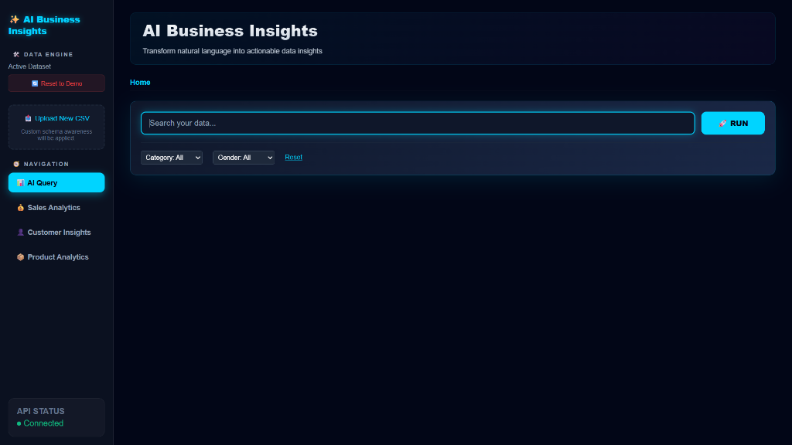

# 🚀 AI-Powered Business Insights Dashboard using Natural Language to SQL

> Transform natural language into SQL queries and interactive business
> insights using Generative AI, Machine Learning, and Business
> Intelligence.


------------------------------------------------------------------------

# 🌐 Live Demo

### Frontend

https://ai-business-insights-dashboard-using-pz9v.onrender.com

### Backend API

https://ai-business-insights-dashboard-using.onrender.com

------------------------------------------------------------------------

# 📖 Overview

AI-Powered Business Insights Dashboard using Natural Language to SQL is a full-stack AI-driven Business Intelligence platform that enables users to analyze structured data using natural language instead of writing SQL queries. The platform is designed to simplify data exploration for business users, analysts, and non-technical stakeholders by combining Generative AI, Machine Learning, and interactive data visualization into a single application.

The system leverages Groq Llama 3.3 to translate natural language questions into SQL queries, validates the generated SQL for security, and executes it against PostgreSQL (Supabase) or SQLite databases. Query results are processed using Pandas and presented through an intuitive React-based dashboard featuring interactive charts, KPI cards, searchable tables, and AI-generated business insights.

In addition to querying existing databases, the platform allows users to upload their own datasets in CSV, Excel (.xlsx/.xls), and other supported tabular formats. Uploaded files are automatically processed, their schema is detected, and they are converted into queryable database tables, enabling users to instantly perform natural language analytics on their own data without any manual database setup or SQL knowledge.

The platform also incorporates Machine Learning techniques such as customer churn prediction and spending anomaly detection to deliver predictive analytics alongside descriptive insights. By integrating AI-powered SQL generation, secure query execution, dynamic dataset ingestion, and business intelligence dashboards, the application provides an end-to-end analytics solution suitable for business reporting, exploratory data analysis, and decision support.
------------------------------------------------------------------------

# ⭐ Highlights

-   🧠 Natural Language → SQL
-   🤖 AI Business Insights
-   📊 Interactive Dashboard
-   🔒 Secure SQL Validation
-   📁 Dynamic CSV Upload
-   ☁️ Full-Stack Deployment on Render
-   🗄 PostgreSQL (Supabase) + SQLite
-   📈 Machine Learning Analytics

------------------------------------------------------------------------

# 🏗 System Architecture

``` text
                                  +----------------------+
                                  |        User          |
                                  +----------+-----------+
                                             |
                                             ▼
                    +-------------------------------------------+
                    |         React + Vite Frontend             |
                    +----------------+--------------------------+
                                     |
                               REST API Calls
                                     |
                                     ▼
                    +-------------------------------------------+
                    |            Flask REST API                 |
                    +----------------+--------------------------+
                                     |
                +--------------------+--------------------+
                |                                         |
                ▼                                         ▼
      Prompt Engineering                        SQL Validation
                |                                         |
                +--------------------+--------------------+
                                     |
                                     ▼
                              Groq Llama 3.3
                                     |
                               Generated SQL
                                     |
                                     ▼
                    +-------------------------------------------+
                    | PostgreSQL (Supabase) / SQLite            |
                    +----------------+--------------------------+
                                     |
                                     ▼
                        Pandas + Machine Learning
                                     |
                                     ▼
                           AI Business Insights
                                     |
                                     ▼
                     Interactive Charts, KPIs & Tables
```

------------------------------------------------------------------------

# 🔄 Workflow

``` text
Natural Language Question
        │
        ▼
Prompt Engineering
        │
        ▼
Groq Llama 3.3
        │
        ▼
SQL Generation
        │
        ▼
SQL Validation
        │
        ▼
Database Execution
        │
        ▼
Data Processing
        │
        ▼
Machine Learning
        │
        ▼
Business Insights
        │
        ▼
Interactive Dashboard
```

------------------------------------------------------------------------

# ✨ Features

## Natural Language to SQL

-   Schema-aware prompt engineering
-   SQL generation
-   SQL validation
-   Read-only execution
-   Syntax correction
-   Query optimization

Example:

``` sql
SELECT location,
SUM(purchase_amount) AS total_purchase_amount
FROM ecommerce_behavior
GROUP BY location
ORDER BY total_purchase_amount DESC
LIMIT 5;
```

## Dashboard

-   KPI Cards
-   Revenue Analysis
-   Sales Trends
-   Customer Insights
-   Product Analytics
-   Interactive Charts
-   Searchable Tables

## AI Insights

-   Executive summaries
-   Trend analysis
-   Business recommendations
-   Statistical summaries

## Machine Learning

-   Customer Churn Prediction
-   Spending Anomaly Detection

## Security

-   Read-only SQL
-   SQL Validation
-   DROP/DELETE/UPDATE/ALTER blocked

------------------------------------------------------------------------

# 🛠 Technology Stack

  Layer        Technologies
  ------------ -------------------------------------------------
  Frontend     React.js, Vite, JavaScript, HTML, CSS, Recharts
  Backend      Python, Flask, REST API
  AI           Groq API, Llama 3.3
  Database     PostgreSQL (Supabase), SQLite
  ML           Pandas, NumPy, Scikit-Learn
  Deployment   Render

------------------------------------------------------------------------

# 📂 Project Structure

``` text
AI-Business-Insights-Dashboard-using-Natural-Language-to-SQL/
│
├── backend/
├── frontend/
├── docs/
├── screenshots/
├── scripts/
├── README.md
├── render.yaml
└── requirements.txt
```

> Stored all images inside the **screenshots/** folder 
------------------------------------------------------------------------

# 📸 Screenshots


``` markdown
## Dashboard


## Natural Language Query


## Generated SQL


## Analytics Dashboard


## AI Insights

```

------------------------------------------------------------------------

# 🚀 Installation

``` bash
git clone https://github.com/sarthak-engineer/AI-Business-Insights-Dashboard-using-Natural-Language-to-SQL.git
cd AI-Business-Insights-Dashboard-using-Natural-Language-to-SQL
```

Backend:

``` bash
cd backend
pip install -r requirements.txt
python app.py
```

Frontend:

``` bash
cd frontend
npm install
npm run dev
```

------------------------------------------------------------------------

# 🔑 Environment Variables

Create `backend/.env`

``` env
GROQ_API_KEY=YOUR_GROQ_API_KEY
SUPABASE_URL=YOUR_SUPABASE_URL
SUPABASE_KEY=YOUR_SUPABASE_KEY
```

------------------------------------------------------------------------

# ☁️ Deployment

  Component   Platform
  ----------- ---------------------
  Frontend    Render Static Site
  Backend     Render Web Service
  Database    Supabase PostgreSQL
  AI Model    Groq Llama 3.3

------------------------------------------------------------------------

# 🧪 Testing

-   Natural Language → SQL
-   SQL Validation
-   PostgreSQL Execution
-   CSV Upload
-   Dashboard Rendering
-   AI Insight Generation

------------------------------------------------------------------------

# 🔮 Future Enhancements

-   Authentication
-   Role-Based Access Control
-   Multi-turn conversations
-   RAG
-   Multi-database support
-   Docker
-   Kubernetes
-   PDF/Excel export

------------------------------------------------------------------------

# 🤝 Contributing

1.  Fork
2.  Create a branch
3.  Commit
4.  Push
5.  Open a Pull Request

------------------------------------------------------------------------

# 📄 License

MIT License.

------------------------------------------------------------------------

# 👨‍💻 Author

**Sarthak**

Artificial Intelligence & Machine Learning Engineer

⭐ If you found this project useful, please consider giving it a
**Star**.
